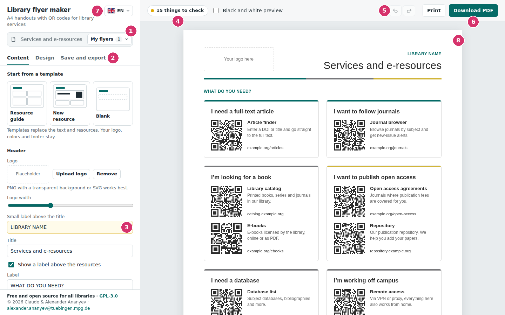
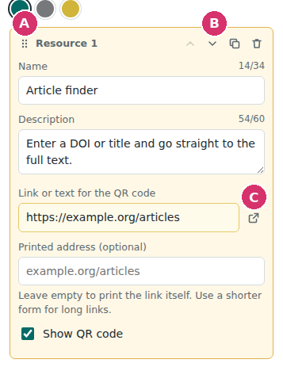
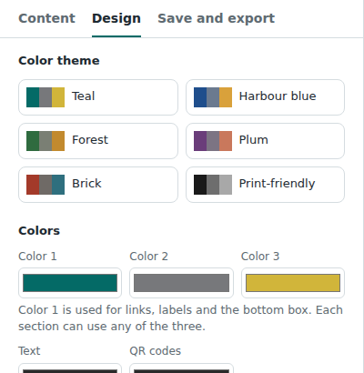
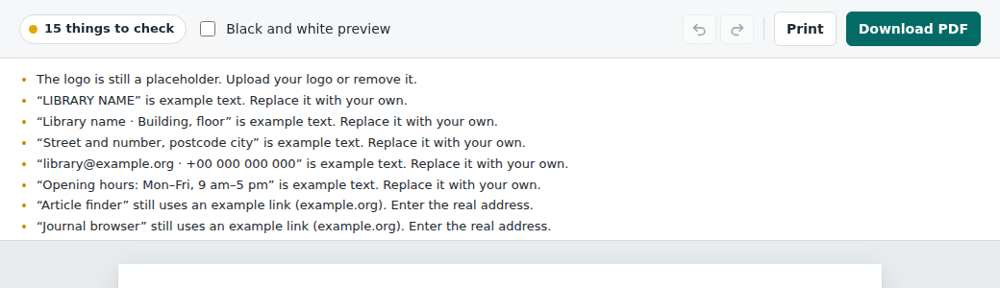
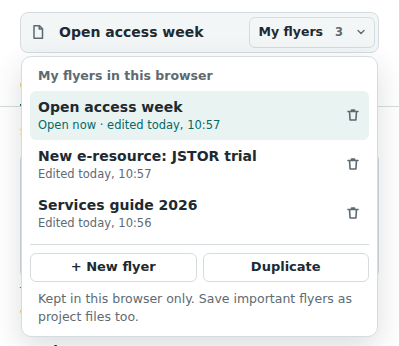
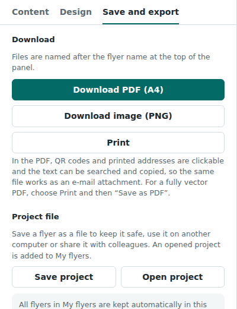

# Library flyer maker: user guide

A step-by-step guide. You don't need any technical knowledge.

## What is this?

Library flyer maker helps you make a one-page A4 flyer about the services of your library. Every service gets a QR code. Readers scan the code with their phone and go straight to the right web page.

- It is free, and it will stay free.
- There is nothing to install. The tool is a single file that opens in your web browser.
- Everything stays on your computer. Nothing is uploaded anywhere.

## What you need

- A computer with an up-to-date web browser: Chrome, Edge, Firefox or Safari.
- The file **library-flyer-maker.html**.
- Your library logo as an image file (PNG, JPG or SVG). This is optional.
- The web addresses of the services you want to show.

## Step 1: Open the tool

1. Save the file **library-flyer-maker.html** somewhere easy to find, for example on your desktop.
2. Double-click the file. It opens in your web browser.
   If it opens in a different program, right-click the file, choose **Open with** and pick your web browser.
3. You now see an example flyer. Everything on it is an example that you will replace with your own details.

**Tip:** To change the language of the buttons (English, Deutsch, Русский), click the flag at the top left.

## Step 2: Find your way around

1. **Flyer name and My flyers.** The name of the flyer you are working on, and the list of all your flyers.
2. **Tabs.** *Content* for texts and links, *Design* for colors and layout, *Save and export* for files.
3. **Fields.** Type here to change the flyer. A yellow field still contains example text.
4. **Check button.** Tells you what still needs your attention. Click it to see the list.
5. **Undo and Redo.** Take back your last change, or bring it back again.
6. **Print** and **Download PDF.**
7. **Language** of the buttons.
8. **Preview.** Shows your flyer exactly as it will be printed. It changes while you type.

## Step 3: Add your library's details

Everything in this step is on the **Content** tab.

1. **Logo:** Click **Upload logo** and choose your logo file. Use the **Logo width** slider to make it bigger or smaller. If you don't want a logo, click **Remove**.
2. **Small label above the title:** Type the name of your library.
3. **Title:** For example "Services and e-resources".
4. **Footer:** Scroll down to the end of the Content tab. Enter your address, e-mail address, phone number and opening hours.

Fields with a **yellow background** still contain example text. The yellow disappears as soon as you type your own text.

## Step 4: Add your services

The flyer is made of **sections**, for example "I'm looking for a book". Each section contains one or more **resources**, for example "Library catalog".

Click a section heading to open it. For each resource, fill in:

- **Name:** short, for example "Library catalog".
- **Description:** one or two short lines. The small counter shows how much space you have, for example *54/60*.
- **Link:** the web address of the service.
  The easiest way: open the page in your browser, click into the address bar at the top, copy the address (**Ctrl+C**, on a Mac **⌘C**) and paste it into this field (**Ctrl+V**, on a Mac **⌘V**).
  You can also enter an e-mail address or a phone number.
- **Printed address** (optional): a shorter version of the address to print under the description. Leave it empty to print the link itself.

The QR code is created automatically.

- **A:** Hold and drag here to move the resource to another place, also into another section.
- **B:** Move the resource up or down, make a copy, or delete it.
- **C:** Open the link in a new tab to check that it works.

More things you can do:

- **Add resource** adds a new resource to a section. **Add section** (below the last section) adds a new section.
- Each section has a **heading** and a **color**. The small buttons next to the section heading move, copy or delete the whole section.
- **Box at the bottom:** an optional box for a contact, for example for interlibrary loan. Untick **Show the box** if you don't need it.
- **Start from a template** (at the top of the Content tab) gives you a different starting point: *Resource guide*, *New resource* or *Blank*. A template replaces the texts and resources. Your logo, colors and footer stay.

## Step 5: Choose the look

Open the **Design** tab.

- **Color theme:** Click a theme to change all colors at once. You can also pick your own colors under **Colors**.
- **Background:** White is best for printing.
- **Layout:** *Two columns* suits most flyers. *Wide rows* suits sections with many resources. *Spotlight* shows the first resource very large, for example to announce something new.
- **Language of the flyer:** Choose the language your flyer is written in, so that long words are split correctly at the end of a line.
- **QR code size:** *Medium* works well. Choose *Small* if the content doesn't fit on one page.

## Step 6: Check your flyer

The check button at the top tells you whether the flyer is ready:

- **Green, "Ready to print":** Everything looks good.
- **Yellow, "… things to check":** There is still example text or an example link (example.org), or something may not look right.
- **Red, "… issues to fix":** For example, the content doesn't fit on one A4 page, or a QR code can't be scanned.

Click the button to open the list. Resources that need your attention have a yellow frame on the Content tab.

**Test the QR codes:** Point your phone camera at a QR code in the preview on your screen. Your phone should offer to open the right page.

**Black and white preview** (next to the check button) shows how the flyer will look on a black-and-white printer.

## Step 7: Print or save as PDF

- **Download PDF** (top right): best for e-mail and for your website. The links in the PDF can be clicked.
- **Print** (top right): sends the flyer to your printer. In the print window, choose **A4** paper and **100 %** (or "Actual size"). If colors or lines are missing, switch on **Background graphics** (in Chrome under *More settings*).
- **Download image (PNG)** (on the *Save and export* tab): for screens, your intranet or social media.

The files get the name of your flyer, which you can change at the top of the panel.

## Step 8: Your work is saved automatically

Every change is kept in your web browser. When you open the file again later, your last flyer is there.

**My flyers:** Click **My flyers** at the top to see all your flyers.

- Click a flyer to open it.
- **+ New flyer** starts a new flyer that already has your logo, colors and footer.
- **Duplicate** makes a copy of the open flyer.
- The **bin** deletes a flyer. Clicked it by mistake? Click **Undo** in the message at the bottom of the screen.
- To **rename** a flyer, click its name in the bar at the top and type.

### Keep a backup and share with colleagues

Your flyers are kept **only in this browser on this computer**. You won't see them in another browser, on another computer or in a private window. They are also lost if the browser data is deleted.

So for flyers that matter, keep a backup:

1. Open the **Save and export** tab.
2. Click **Save project**. A small file ending in **.json** is downloaded. Keep it somewhere safe.

To continue on another computer, or to give a flyer to a colleague, send the **.json** file together with **library-flyer-maker.html**. On the other computer, click **Open project** and choose the .json file. The flyer is added to *My flyers* there.

## Made a mistake?

Click **Undo** (the curved arrow at the top right) or press **Ctrl+Z** (on a Mac **⌘Z**). To bring a change back, click **Redo** or press **Ctrl+Y** (on a Mac **⇧⌘Z**).

Each flyer remembers its own changes as long as the page stays open.

To start again from the beginning: **Save and export** tab → **Start over with the example**. You can undo this, too.

## Questions and answers

**My flyer is gone!**
You probably opened the tool in a different browser, on a different computer or in a private window. Open it again in the browser you used before, or click **Open project** and choose your saved .json file.

**The content doesn't fit on one page.**
Shorten the descriptions, remove a resource, choose *Small* QR codes on the Design tab, or switch to *Two columns*.

**A QR code doesn't scan.**
Use dark QR codes on a white background, choose a larger QR code size, and use a shorter link if you can.

**Some of our links only work inside our network.**
That's fine, but readers outside need VPN. The check list reminds you of such links.

**Do I need an internet connection?**
No. The tool works offline. Of course, your readers need internet on their phones to open the links.

**Is my data sent anywhere?**
No. Texts, links and logos stay on your computer.

**Does it cost anything?**
No. The tool is free and open source (GNU General Public License, version 3). You are welcome to pass it on to other libraries.

**Where can I get help or suggest an idea?**
Write to alexander.ananyev@tuebingen.mpg.de.
