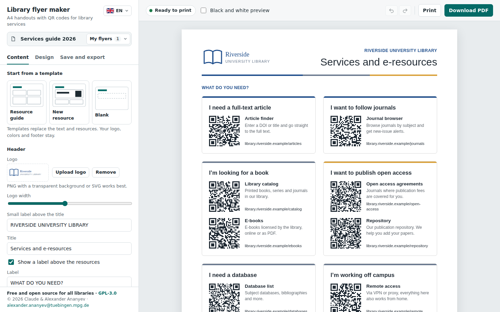
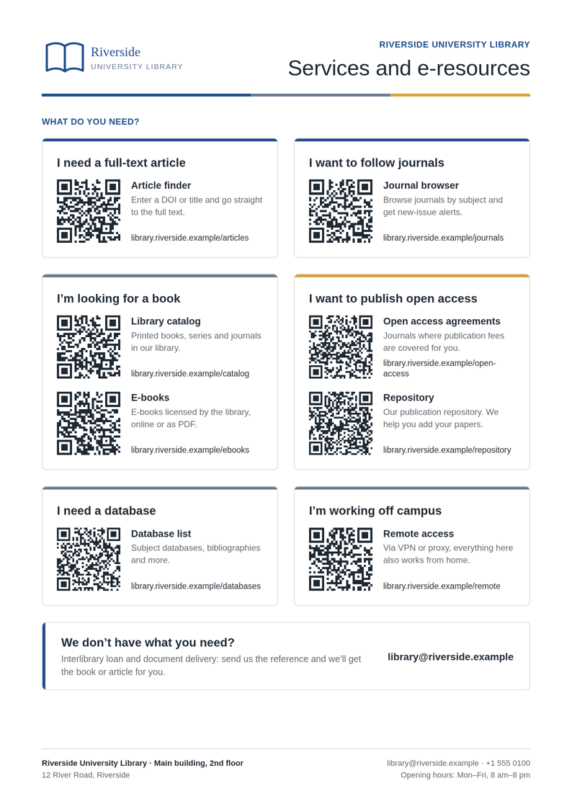

# Library flyer maker

Make one-page A4 flyers with QR codes for your library's services, in minutes.
Free and open source. Nothing to install: the whole tool is a single HTML file that runs in your web browser, also offline.



**[⬇ Download the latest version](../../releases/latest)** · **[▶ Use it online](https://exponatus.github.com/library-flyer-maker/)** · **[📖 User guide](GUIDE.md)** ([PDF](docs/Library-flyer-maker-guide.pdf))

Interface in English, Deutsch and Русский.

## Why?

Libraries pay for many good services: link resolvers, journal browsers, e-books, databases, open access agreements. Many readers never find them. A single printed sheet with QR codes, on reading room tables, at the service desk or in welcome packs, takes readers straight to the right page.

Library flyer maker lets library staff make such a sheet without design software and without technical knowledge.

## Features

- **Templates:** resource guide, spotlight for a new resource, blank.
- **QR codes** made in the browser for web addresses, e-mail addresses, phone numbers or any text.
- **Checks before printing:** content taller than the page, QR codes that phones can't read, text that doesn't fit, example text or example links left over, internal addresses that need VPN.
- **Your look:** logo, six color themes or your own colors, three layouts, two typefaces, card styles, three QR code sizes.
- **Export:** A4 PDF with clickable links and searchable text, PNG image, or print.
- **My flyers:** several flyers are kept in the browser automatically. Project files (.json) for backups and for sharing with colleagues.
- **Comfortable editing:** undo and redo (Ctrl+Z / Ctrl+Y), drag and drop, duplicate, live preview, black-and-white preview.
- **Languages:** interface in English, German and Russian; correct hyphenation for the language of the flyer.
- **Private and offline:** no server, no tracking, no cookies. Nothing leaves your computer.

## Getting started

### For library staff

1. [Download](../../releases/latest) the file **library-flyer-maker.html**.
2. Double-click it. It opens in your web browser.
3. Follow the [user guide](GUIDE.md). It explains every step in plain words.

### Use it online

Open **https://exponatus.github.com/library-flyer-maker/**. It works the same way. The online version keeps its own list of flyers, separate from the downloaded file.

### Pass it on

You are welcome to send the file to other libraries. It is free for everyone, now and in the future.

## Example



[Example flyer as PDF](docs/example-flyer.pdf) (fictional library)

## Privacy

- The tool loads nothing from the internet. The libraries, the QR code generator and the PDF export are all inside the file.
- Flyers are stored only in your browser's local storage on your computer.
- Project files (.json) are saved wherever you choose.
- Only your readers' phones open the links on the printed flyer.

## Browser support

Current versions of Chrome, Edge, Firefox and Safari on desktop computers. The tool is developed and tested mainly in Chrome. The editor also works on tablets and phones, but a larger screen is more comfortable.

Good to know: in Chrome and Edge, all HTML files opened from your disk share the same browser storage. A newer version of the file therefore shows the flyers saved with an older one.

## Languages

| Interface | Flyer text and hyphenation |
|---|---|
| English, Deutsch, Русский | any language; hyphenation for Czech, Danish, Dutch, English, French, German, Italian, Polish, Portuguese, Russian, Spanish, Swedish, Turkish and Ukrainian (depends on the browser) |

Would you like the interface in your language? See [CONTRIBUTING.md](CONTRIBUTING.md#translate-the-interface).

## Repository contents

```
library-flyer-maker.html   the tool: everything in one file
index.html                 forwards the online version to the tool
GUIDE.md                   user guide for library staff
docs/                      guide as PDF, example flyer, screenshots
CHANGELOG.md               what changed in each version
CONTRIBUTING.md            how to report problems, translate and contribute
LICENSE                    GNU General Public License v3.0
```

## How it works

For people who want to look inside or change the tool.

- Plain HTML, CSS and JavaScript. No framework, no build step, no dependencies to install.
- The file contains four script blocks: three bundled libraries (unchanged, minified) and the app itself. The app starts with the interface texts (`I18N`), the example content (`EXAMPLES`) and the list of interface languages (`UI_LANGS`).
- The whole flyer is one JSON object. Every change is recorded as one undo step; typing in one field is grouped into one step.
- Browser storage keys: `flyer-maker-index` (list of flyers), `flyer-maker-flyer:<id>` (one flyer), `flyer-maker-logo:<hash>` (each logo once).
- PDF export renders the page with html2canvas at three times the resolution. On top of the image, jsPDF adds clickable link areas and an invisible text layer, so the text can be searched and copied. The text layer uses a tiny embedded font (7 KB, widths only) for Latin and Cyrillic letters.
- Before export, line breaks are fixed as the browser shows them, so hyphenated words look the same in the PDF as on screen.
- Project files and stored data are checked before use: colors, sizes, options and logos are validated, and all text is escaped.

## Contributing

Bug reports, ideas and translations are very welcome. Please read [CONTRIBUTING.md](CONTRIBUTING.md).

## License

Library flyer maker is licensed under the [GNU General Public License v3.0 or later](LICENSE).

In plain words: everyone may use, copy, share and change the tool free of charge. Whoever passes on the tool, changed or unchanged, must pass it on under the same license with its full source, so it stays free and open for all libraries.

Bundled third-party software, with license texts at the end of the HTML file:

- [qrcode-generator](https://github.com/kazuhikoarase/qrcode-generator) 1.4.4 by Kazuhiko Arase, MIT License
- [html2canvas](https://github.com/niklasvh/html2canvas) 1.4.1 by Niklas von Hertzen, MIT License
- [jsPDF](https://github.com/parallax/jsPDF) 2.5.1 by James Hall and yWorks GmbH, MIT License
- a small font derived from [DejaVu Sans](https://dejavu-fonts.github.io/), Bitstream Vera Fonts License

## Authors

Alexander Ananyev and Claude 😎
Contact: [alexander.ananyev@tuebingen.mpg.de](mailto:alexander.ananyev@tuebingen.mpg.de)
